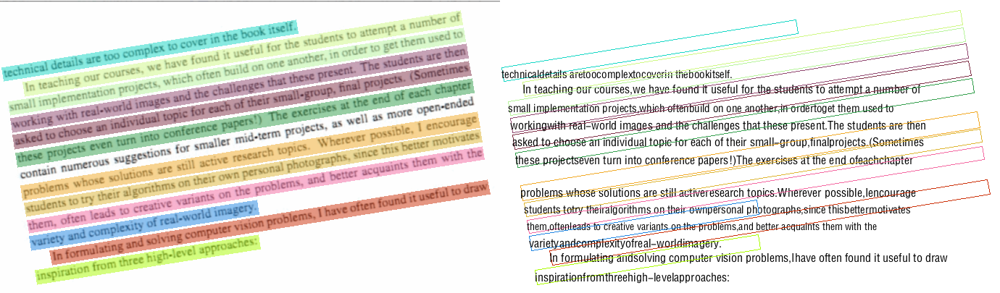

## 快速的ppocr封装

### 效果演示



### 快速开始

**部署构建服务**

```shell
git clone 本仓库
docker build -t ocr:latest .
docker run -it -p 9001:9001 ocr:latest
```

**访问服务**

```python
# base64 访问
import base64
import requests

url = 'http://localhost:9001/ocr'
img_path = 'assets/1.png'

with open(img_path, 'rb') as fa:
    img_str = base64.b64encode(fa.read())

payload = {'image_data': img_str}
response = requests.post(url, data=payload)

print(response.json())
```

```python
# 上传文件访问
import requests

url = 'http://localhost:9001/ocr'
img_path = 'assets/1.png'

with open(img_path, 'rb') as f:
    file_dict = {'image_file': (img_path, f, 'image/png')}
    response = requests.post(url, files=file_dict, timeout=60)

print(response.json())
```

如果正确以上步骤则会返回

```python
{
    "0": {
        "rec_txt": "你好 我是某某某，",  # 识别的文本
        "dt_boxes": [  # 依次为左上角 → 右上角 → 右下角 → 左下角
            [265, 18],
            [472, 231],
            [431, 271],
            [223, 59]
        ],
        "score": "0.8175641223788261"  # 置信度
    }
}
```